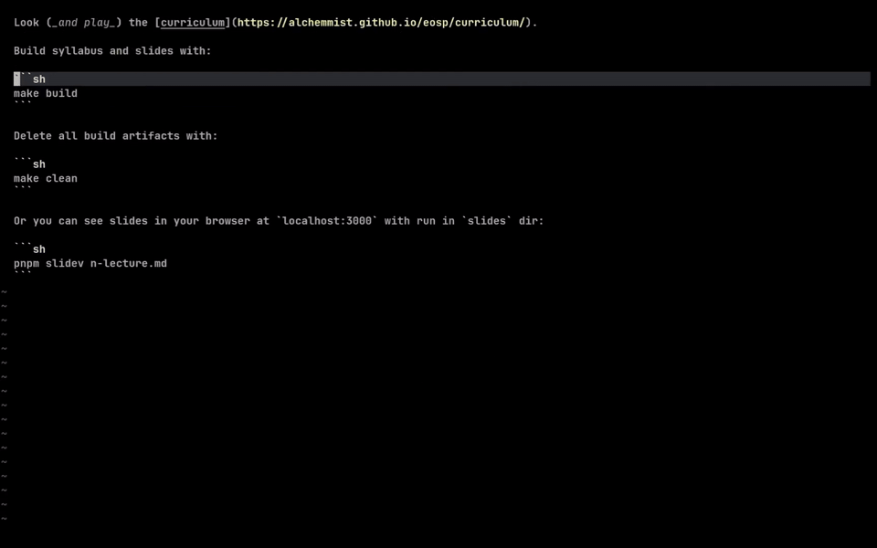
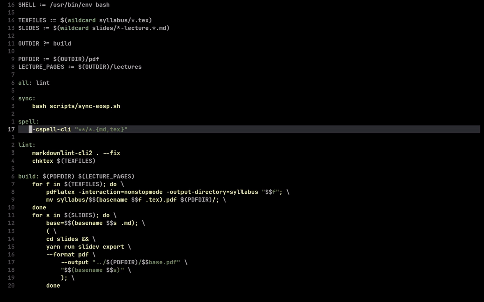

# ObscuraVim

[](https://neovim.io)
[](https://www.lua.org)
[](LICENSE)

ObscuraVim is a minimal, fast, and honest Neovim configuration. It keeps the interface quiet, the controls explicit, and the workflow centered on the keyboard, search, and predictable tools. You get a clean editor that feels like stock Neovim until you need power, then it shows up right under your fingers.

## Philosophy

ObscuraVim is an editor, not an IDE. It refuses to replace understanding with UI. Code is text, and text deserves a direct, transparent editing experience where every action is clear, intentional, and reversible. The goal is control, not spectacle.

Visual noise dilutes focus. The palette is restrained, contrast is intentional, and “highlight everything” is treated as a bug. LSP is here for truth: precise diagnostics, hover context, and fast definitions without the distraction of constant, unsolicited overlays.

Search is the core skill of deep work. Telescope, ripgrep, and FZF turn any codebase into a map you can traverse without losing flow. Completion is on demand, not hijacking your typing. Formatting is yours to command: one key can run it, but you decide the binaries, flags, and scope.

This is a configuration built for steady concentration. It is minimal in surface area, not in capability. The fewer moving parts you see, the more you can trust the ones you choose to invoke.

## What’s Inside

Search, files, navigation, formatting, snippets, and a subdued theme are wired together with lazy loading and pinned versions for stability. The stack includes Telescope + FZF + ripgrep, Oil, Flash + UFO, Conform, Blink.cmp + LuaSnip, and Moss.

## Installation

### Quick Start

```bash
# Backup if needed
mv ~/.config/nvim ~/.config/nvim.bak

# Clone
git clone https://github.com/obscura-vim/obscura-vim.git ~/.config/nvim

# Launch
nvim
```

On first launch `lazy.nvim` will bootstrap and install plugins.

### Dependencies

Required:

`git`, `make` (for `telescope-fzf-native`), `rg` (ripgrep).

Optional:

`node` and `npm` (for `markdown-preview.nvim`), local formatters (see `lua/plugins/configs/conform.lua`), and LSP servers via `mason.nvim`.

### LSP Install

```vim
:Mason
:MasonInstallAll
```

## Demos (Foldable GIFs)

<details>
<summary>File and text search (Telescope)</summary>


</details>

<details>
<summary>Navigation and jumps (Flash, buffers)</summary>


</details>

<details>
<summary>Formatting and edits</summary>


</details>

## Keybindings (Highlights)

Leader is `Space`.

- `Space + ff` — find files
- `Space + fw` — live grep
- `Tab` — buffers picker
- `Ctrl + e` — Oil file manager
- `s` — Flash jump
- `gq` — format via Conform
- `Visual + Ctrl + r` — rename via `rgr`
- `K` — hover (LSP)
- `gd` — go to definition (LSP)
- `E` — floating diagnostic

Full list is in `lua/core/mappings.lua`.

## Project Structure

```text
.
├── init.lua
├── lazy-lock.json
├── lua
│   ├── core
│   │   ├── init.lua
│   │   ├── bootstrap.lua
│   │   └── mappings.lua
│   ├── plugins
│   │   ├── init.lua
│   │   └── configs
│   │       ├── conform.lua
│   │       ├── lazy_nvim.lua
│   │       ├── lspconfig.lua
│   │       ├── mason.lua
│   │       ├── others.lua
│   │       ├── telescope.lua
│   │       └── treesitter.lua
│   └── snippets.lua
├── ftplugin
│   ├── css.lua
│   ├── html.lua
│   ├── java.lua
│   ├── javascript.lua
│   ├── javascriptreact.lua
│   ├── opml.lua
│   ├── tex.lua
│   ├── typescript.lua
│   └── typescriptreact.lua
└── docs
    └── gifs
```

`init.lua` is the entry point and bootstraps `lazy.nvim`. Core options and keymaps live in `lua/core`, plugin specs and setup are in `lua/plugins`, and per-tool configs are in `lua/plugins/configs`. Language-specific tweaks sit in `ftplugin`, snippets live in `lua/snippets.lua`, demos are in `docs/gifs`, and `lazy-lock.json` pins plugin versions.

## Contributing

Contributions are welcome. Please keep changes minimal and purposeful, explain why they’re worth the cost in complexity, and prefer clarity over cleverness. If you propose a new plugin, justify it against performance and simplicity.

## Feedback

Issues and PRs are the best place for bugs, ideas, and discussion.
